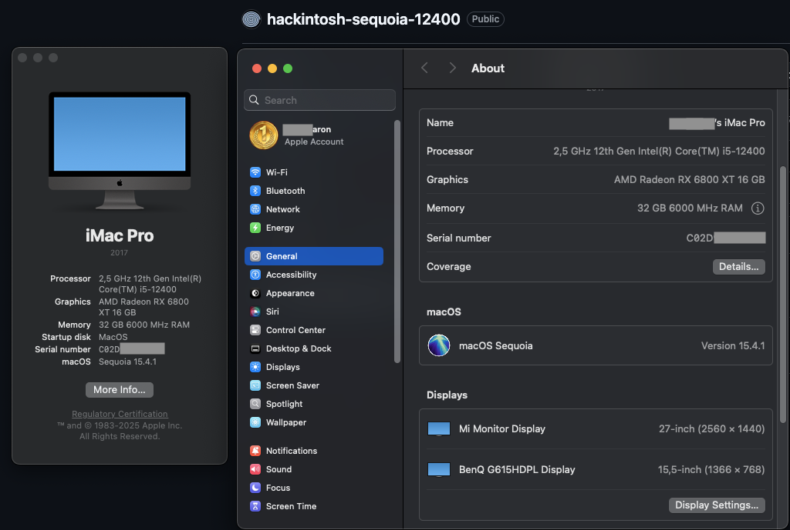

# hackintosh-sequoia-12400
# Hackintosh Sequoia (OpenCore EFI)

This repository contains an OpenCore EFI for a custom Hackintosh build named "Sequoia". The EFI is configured to run macOS on a Gigabyte B760M DS3H AX DDR5 system with an AMD GPU. The goal is a smooth dual-boot setup with Windows 11 (on NVMe1) and macOS (on NVMe2).

## System / Hardware

| Component | Model |
|---|---|
| Motherboard | Gigabyte B760M DS3H AX DDR5 |
| CPU | Intel i5 12400 (Non F) |
| GPU | Sapphire Nitro+ RX 6800 XT 16GB |
| RAM | ADATA 2 × 16 GB 6000 MHz |
| NVMe 1 (Windows) | Team Group MP44L 1 TB (Gen4) |
| NVMe 2 (macOS) | ADATA 850 Lite 512 GB (macOS install) |
| SATA SSD | Team Group Vulcan 512 GB |
| HDD 2.5" | Seagate 1 TB |
| HDD 3.5" | WD Purple 4 TB |
| Keyboard | Langtu GK64 |
| Mouse | Logitech M330 |
| Monitor 1 | Xiaomi A27Qi 27" (2560×1440) |
| Monitor 2 | BenQ G615HDPL 15.5" (1366×768) |

## Repository layout (important paths)

- `EFI/OC/config.plist` — your OpenCore configuration.
- `EFI/OC/ACPI/` — SSDTs used for various fixes (EC, USB, USBX, etc.).
- `EFI/OC/Kexts/` — kernel extensions used (VirtualSMC, Lilu, Whatever is present in this repo).
- `EFI/OC/Drivers/` — OpenCore drivers required at boot.

Check `EFI/OC/` first when troubleshooting boot or hardware issues.

## What works (tested)

These items are working reliably in this configuration:

- Wi‑Fi 2.4 GHz (HeliPort + itlwm family support)
- Wi‑Fi 5 GHz (where supported by the card/driver)
- Bluetooth (basic devices pairing and audio)
- Dual-boot: Windows 11 on NVMe1 and macOS on NVMe2 via OpenCore menu
- Dual-monitor setup (external monitors recognized, extended/duplicate displays)
- GPU acceleration for RX 6800 XT (no kext changes required after upgrading from RX 6700 XT)
- Audio (AppleALC or alternative pin config in-place)
- USB ports (including XHCI fixes and USB mapping via SSDTs / `USBPorts.kext`)
- Sleep / Wake (basic sleep, wake tested)
- Screensaver animations and UI graphics
- Keyboard and mouse (Langtu GK64 and Logitech M330)
- NVMe and SATA storage detection

Notes: Wi‑Fi uses HeliPort for GUI control. RGB control for system lighting uses OpenRGB.

## What doesn't work / known limitations

- AirDrop — not functional on this hardware/configuration.
- RAM per‑LED RGB control — modules show colors but per-effect/brightness/speed control for the RAM is not available (we can read RGB as 'on' but not programmatically change types/animations reliably).

These are hardware/protocol limitations or require vendor-specific firmware/APIs that are not available in macOS on this platform.

## Important notes & tips

- GPU upgrade note: This setup previously used a Red Devil RX 6700 XT. Upgrading to a Sapphire Nitro+ RX 6800 XT worked without changing kexts or major config. If you change GPUs again, check `config.plist` device properties and framebuffer patches.
- Wi‑Fi: HeliPort is used as the user-facing app for network selection when using Intel-based Wi‑Fi patched drivers (itlwm). Keep `HeliPort.app` updated. If networks disappear after sleep, toggle the interface or re-run HeliPort.
- RGB: OpenRGB provides system-wide RGB control. Some devices (especially RAM) rely on vendor-specific controllers that OpenRGB cannot fully manage.
- Dual boot: When installing or updating Windows, be careful not to overwrite your OpenCore EFI on the system disk. Prefer installing Windows to NVMe1 and macOS to NVMe2 as currently set up.
- Backups: Keep a copy of `EFI/OC/` (and especially `config.plist`) off the EFI partition. Before any macOS update, snapshot the EFI folder in case you need to roll back.

## Troubleshooting quick checklist

1. Boot fails / black screen:
	- Reboot into OpenCore's picker and try `Safe Mode` or `Verbose` mode.
	- Check `Drivers` and make sure OpenRuntime/OpenCanopy are present.
	- Verify `config.plist` Serial/SMBIOS are correct.

2. USB devices not recognized:
	- Ensure correct USB mapping (SSDTS + `USBPorts.kext`), and disable unwanted ports via SSDT if necessary.

3. No audio:
	- Verify `AppleALC.kext` + Lilu are present and layout-id/patches match your motherboard audio codec.

4. Wi‑Fi or Bluetooth issues:
	- Confirm the correct kext (itlwm family for Intel), run HeliPort for Wi‑Fi; for Bluetooth, try re-pairing devices in Bluetooth settings.

## How to use this EFI (short)

1. Mount the EFI partition of your macOS disk or USB installer.
2. Copy this repo's `EFI/` folder to the EFI partition root (replace existing EFI after backing up).
3. Check `EFI/OC/config.plist` and update paths/serials if you customized SMBIOS or serial numbers.
4. Reboot and choose the OpenCore entry to boot macOS or Windows.

## Recommended resources

- OpenCore Install Guide — follow for proper SMBIOS and kext/driver versions.
- Dortania's guide for USB mapping and ACPI patching.
- HeliPort documentation for Wi‑Fi GUI usage.
- OpenRGB project for RGB control notes.

## Credits & Acknowledgements

This EFI bundles many community contributions (Lilu, VirtualSMC, Whatever is included in `Kexts/`), and uses SSDTs and drivers adapted from public guides. Please consult the upstream projects for licensing and attribution.
